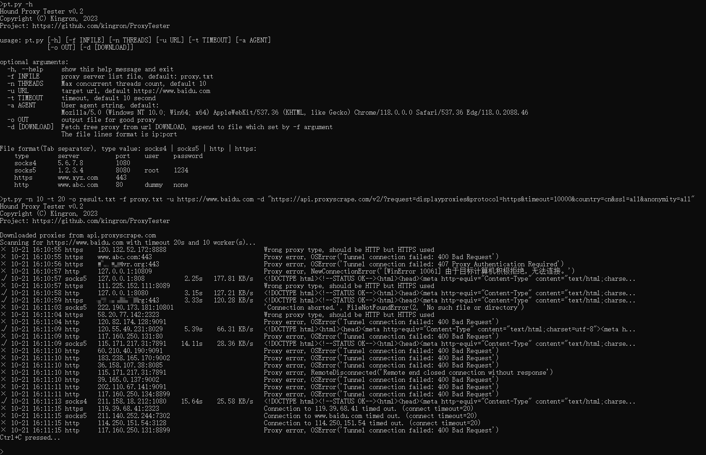

# ProxyTester

Test proxy service usable by given url

## usage
```
ProxyTester v0.2
Copyright (C) Kingron, 2023
Project: https://github.com/kingron/ProxyTester

usage: pt.py [-h] [-f INFILE] [-n THREADS] [-u URL] [-t TIMEOUT]
             [-a AGENT]

optional arguments:
  -h, --help  show this help message and exit
  -f INFILE   proxy server list file, default: proxy.txt
  -n THREADS  Max concurrent threads count, default 10
  -u URL      target url, default https://www.baidu.com
  -t TIMEOUT  timeout, default 10 second
  -a AGENT    User agent string, default:
              Mozilla/5.0 (Windows NT 10.0; Win64; x64) AppleWebKit/537.36 (KHTML, like Gecko) Chrome/118.0.0.0 Safari/537.36 Edg/118.0.2088.46

File format(Tab separator), type value: socks4 | socks5 | http | https:
    type        server          port    user    password
    socks4      5.6.7.8         1080
    socks5      1.2.3.4         8080    root    1234
    https       www.xyz.com     443
    http        www.abc.com     80      dummy   none
```
## screenshots

